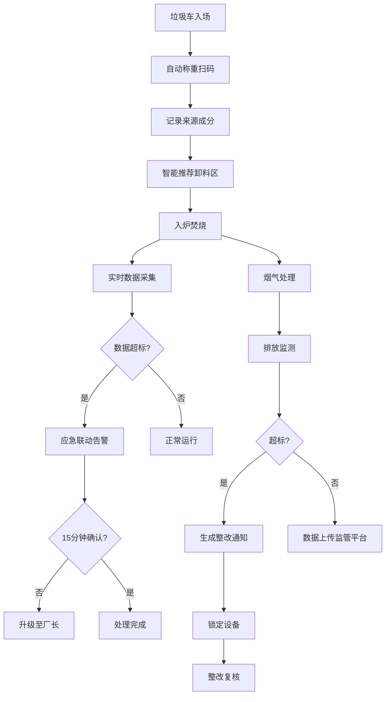

## 1. 产品概述

大型垃圾焚烧发电厂智慧运营与环保监管平台，整合垃圾入场、焚烧发电、烟气处理、炉渣渗滤液处置及设备运维全流程，实现智能化、可视化、可追溯的全链条管理。

- 主要目的：通过数字化手段提升垃圾焚烧发电厂运营效率，保障环保合规，降低运维成本，实现安全生产
- 解决问题：人工记录效率低、数据孤岛、环保监管难、应急响应慢、设备运维被动
- 目标用户：入场值班员、运行值长、维修工、安环部、财务、厂长六级角色

## 2. 核心特性

### 2.1 用户角色

| 角色 | 注册方式 | 核心权限 |
|------|----------|----------|
| 入场值班员 | 系统分配 | 查看车辆数据、入场登记、称重扫码 |
| 运行值长 | 系统分配 | 查看生产数据、监控焚烧发电、应急响应 |
| 维修工 | 系统分配 | 查看分配工单、扫码报修、工单处理 |
| 安环部 | 系统分配 | 查看环保数据、排放监控、整改管理 |
| 财务 | 系统分配 | 成本核算、采购审批、报表导出 |
| 厂长 | 系统分配 | 全局管理、审批规则调整、数据总览 |

### 2.2 功能模块

1. **登录页**：身份验证、角色选择、权限验证
2. **首页大屏**：焚烧线负荷、烟气排放曲线、发电量对比、药剂消耗趋势、设备完好率
3. **垃圾入场管理**：车辆登记、自动称重、扫码记录、卸料推荐、入炉顺序
4. **焚烧发电监控**：实时数据采集、温度压力监控、超标告警、应急联动、发电并网
5. **烟气处理监管**：排放监测、药剂库存、采购建议、多级审批
6. **炉渣渗滤液处置**：炉渣分选、金属回收、液位监测、出水指标、备用工艺
7. **设备运维管理**：巡检工单、扫码报修、紧急度指派、升级机制
8. **系统管理**：权限配置、审批规则、数据导出、班次筛选

### 2.3 页面详情

| 页面名称 | 模块名称 | 功能描述 |
|---------|----------|----------|
| 登录页 | 身份认证 | 用户名密码登录、角色自动识别、忘记密码 |
| 首页大屏 | 数据可视化 | 焚烧线负荷仪表盘、烟气排放实时曲线、发电量对比柱状图、药剂消耗趋势图、设备完好率环形图、告警滚动通知 |
| 垃圾入场管理 | 车辆管理 | 车辆列表、入场登记、称重记录、来源成分记录、卸料区域推荐、入炉顺序智能推荐 |
| 焚烧发电监控 | 实时监控 | 焚烧炉温湿度压力实时曲线、排放数据5秒刷新、超标告警弹窗、应急联动按钮、发电负荷调节、发电量超额预警 |
| 烟气处理监管 | 环保监管 | 烟气排放数据展示、药剂库存预警、采购申请、多级审批流程（运营主管→设备经理→总经理）、整改通知管理 |
| 炉渣渗滤液处置 | 处置管理 | 炉渣分选参数调整、金属含量监测、产出库存记录、渗滤液液位监控、出水指标监测、备用工艺自动启动 |
| 设备运维管理 | 工单管理 | 巡检工单生成、扫码报修、紧急度分级、维修班组指派、超2小时升级机制、设备完好率统计 |
| 系统管理 | 配置管理 | 用户权限管理、审批规则配置、班次日期筛选、月度报告导出、环保合规明细导出 |

## 3. 核心流程

### 3.1 垃圾入场流程
垃圾车入场 → 自动称重 → 扫码记录来源和成分 → 系统根据库存和发酵周期推荐卸料区域 → 卸料完成 → 推荐入炉顺序

### 3.2 超标告警流程
焚烧数据超标 → 自动联动应急系统 → 推送告警到值班主管 → 15分钟未确认 → 自动升级至厂长

### 3.3 采购审批流程
药剂库存低于安全线 → 自动生成采购建议 → 运营主管审批 → 设备经理审批 → 总经理审批 → 采购执行

### 3.4 报修升级流程
扫码发现故障 → 一键报修 → 按紧急度指派维修班组 → 超2小时未接单 → 自动升级至设备部长

### 3.5 环保超标流程
排放数据超标 → 自动生成整改通知 → 锁定相关设备 → 整改完成 → 复核通过 → 设备解锁

## 4. 用户界面设计

### 4.1 设计风格
- **主色调**：工业蓝 (#0F4C81) 搭配环保绿 (#28A745)，辅以警示橙 (#FF6B35) 和告警红 (#DC3545)
- **整体风格**：工业科技风，深色主题（适合24小时监控室使用），数据可视化突出
- **按钮风格**：微立体边框按钮，圆角4px，悬浮阴影效果
- **字体**：主字体使用 Roboto Mono（数据展示）搭配 Source Han Sans CN（中文内容）
- **布局风格**：栅格化布局，卡片式模块，顶部导航 + 左侧菜单 + 主内容区
- **图标风格**：线性图标，统一粗细，工业设备主题

### 4.2 页面设计概述

| 页面名称 | 模块名称 | UI元素 |
|---------|----------|--------|
| 登录页 | 身份认证 | 渐变背景、logo展示、表单卡片、角色图标、错误提示动效 |
| 首页大屏 | 数据可视化 | 大型仪表盘、实时曲线图、数据卡片网格、告警跑马灯、动效数字 |
| 垃圾入场管理 | 车辆管理 | 数据表格、筛选器、扫码模拟、智能推荐卡片、状态标签 |
| 焚烧发电监控 | 实时监控 | 多轴折线图、数据面板、告警弹窗、控制按钮组、状态指示灯 |
| 烟气处理监管 | 环保监管 | 排放对比图、库存仪表盘、审批流程时间线、整改单卡片 |
| 炉渣渗滤液处置 | 处置管理 | 分选参数控制面板、金属含量趋势、液位指示器、工艺切换按钮 |
| 设备运维管理 | 工单管理 | 工单看板、紧急度色标、升级倒计时、报修二维码、处理进度条 |
| 系统管理 | 配置管理 | 权限矩阵、审批流程图、日期选择器、导出按钮组 |

### 4.3 响应式
- 桌面端优先设计，适配1920x1080及以上分辨率
- 侧边栏可折叠，适配不同屏幕宽度
- 数据表格支持水平滚动，保证小屏设备可用性
- 移动端适配主要监控页面，支持查看关键指标和告警

### 4.4 动效设计
- 页面加载：卡片渐入 + 数据数字滚动动画
- 告警触发：红色边框闪烁 + 声音提示 + 弹窗滑入
- 数据更新：数值变化平滑过渡，曲线实时延伸
- 按钮交互：悬浮上浮效果，点击波纹反馈
- 流程进度：步骤条点亮动画，审批节点连线效果
