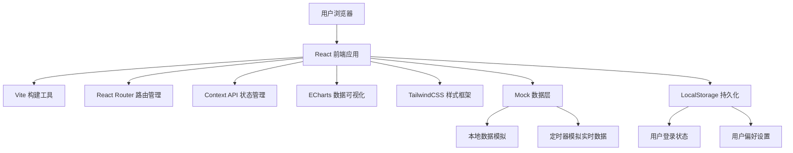
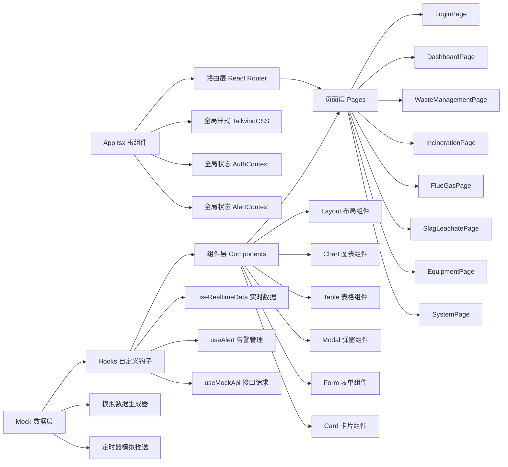
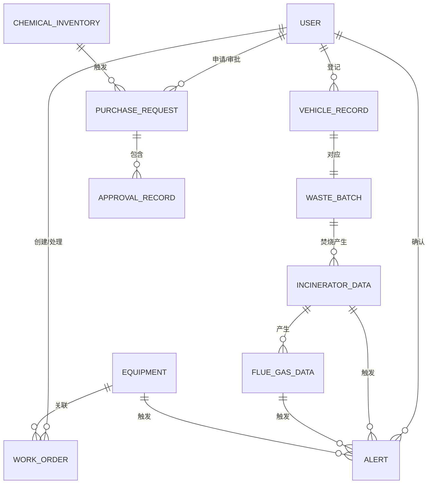

## 1. 架构设计



## 2. 技术描述

- **前端框架**: React@18.2.0 + TypeScript
- **构建工具**: Vite@5.0.0
- **样式框架**: TailwindCSS@3.4.0
- **路由管理**: React Router DOM@6.20.0
- **图表库**: ECharts@5.4.3 + echarts-for-react@3.0.2
- **图标库**: Lucide React@0.294.0
- **状态管理**: React Context API + useReducer
- **数据持久化**: LocalStorage
- **数据格式**: TypeScript Interface 定义 + Mock 数据
- **日期处理**: date-fns@3.0.0

## 3. 路由定义

| Route | 页面 | 权限角色 | 说明 |
|-------|------|----------|------|
| `/login` | 登录页 | 公开 | 用户身份验证，角色自动识别 |
| `/dashboard` | 首页大屏 | 所有登录用户 | 全局数据可视化总览 |
| `/waste-management` | 垃圾入场管理 | 入场值班员、运行值长、厂长 | 车辆登记、称重、卸料推荐 |
| `/incineration` | 焚烧发电监控 | 运行值长、安环部、厂长 | 实时监控、告警、发电调节 |
| `/flue-gas` | 烟气处理监管 | 运行值长、安环部、财务、厂长 | 排放监测、药剂管理、审批 |
| `/slag-leachate` | 炉渣渗滤液处置 | 运行值长、安环部、厂长 | 炉渣分选、渗滤液处理 |
| `/equipment` | 设备运维管理 | 维修工、运行值长、厂长 | 工单管理、报修、巡检 |
| `/system` | 系统管理 | 厂长、系统管理员 | 权限配置、审批规则、数据导出 |
| `*` | 404页面 | 公开 | 路由不匹配时显示 |

## 4. API 定义（Mock层）

### 4.1 类型定义

```typescript
// 用户类型
interface User {
  id: string;
  username: string;
  name: string;
  role: 'gatekeeper' | 'operator' | 'maintenance' | 'safety' | 'finance' | 'director';
  permissions: string[];
  avatar?: string;
}

// 车辆入场记录
interface VehicleRecord {
  id: string;
  plateNumber: string;
  driverName: string;
  source: string;
  wasteType: string;
  weight: number;
  arrivalTime: string;
  unloadingArea: string;
  status: 'pending' | 'weighing' | 'unloading' | 'completed';
}

// 焚烧炉实时数据
interface IncineratorData {
  id: string;
  name: string;
  temperature: number;
  pressure: number;
  oxygenContent: number;
  load: number;
  status: 'normal' | 'warning' | 'alarm';
  timestamp: string;
}

// 烟气排放数据
interface FlueGasData {
  id: string;
  timestamp: string;
  so2: number;
  nox: number;
  dust: number;
  co: number;
  hcl: number;
  isStandard: boolean;
}

// 药剂库存
interface ChemicalInventory {
  id: string;
  name: string;
  currentStock: number;
  safeStock: number;
  unit: string;
  lastPurchaseDate: string;
  status: 'normal' | 'low' | 'critical';
}

// 采购申请
interface PurchaseRequest {
  id: string;
  chemicalId: string;
  chemicalName: string;
  quantity: number;
  estimatedCost: number;
  applicant: string;
  applyTime: string;
  status: 'pending' | 'approved1' | 'approved2' | 'approved3' | 'rejected' | 'completed';
  approvals: {
    level: number;
    approver: string;
    comment: string;
    time: string;
  }[];
}

// 设备工单
interface WorkOrder {
  id: string;
  equipmentId: string;
  equipmentName: string;
  type: 'inspection' | 'repair' | 'maintenance';
  priority: 'low' | 'medium' | 'high' | 'urgent';
  description: string;
  reporter: string;
  assignee: string;
  status: 'pending' | 'accepted' | 'processing' | 'completed';
  createTime: string;
  acceptTime?: string;
  completeTime?: string;
  escalationTime?: string;
}

// 告警信息
interface Alert {
  id: string;
  type: 'temperature' | 'pressure' | 'emission' | 'equipment' | 'inventory';
  level: 'info' | 'warning' | 'critical';
  message: string;
  source: string;
  timestamp: string;
  confirmed: boolean;
  confirmedBy?: string;
  confirmedTime?: string;
  escalated: boolean;
}
```

### 4.2 Mock API 接口

| 接口名 | 方法 | 说明 |
|--------|------|------|
| `login(username, password)` | POST | 用户登录验证 |
| `getCurrentUser()` | GET | 获取当前登录用户 |
| `getVehicleRecords(params)` | GET | 获取车辆入场记录列表 |
| `createVehicleRecord(data)` | POST | 新增车辆入场记录 |
| `getIncineratorRealtime()` | GET | 获取焚烧炉实时数据 |
| `getFlueGasHistory(timeRange)` | GET | 获取烟气历史数据 |
| `getChemicalInventory()` | GET | 获取药剂库存列表 |
| `createPurchaseRequest(data)` | POST | 创建采购申请 |
| `approvePurchase(requestId, level, comment)` | POST | 审批采购申请 |
| `getWorkOrders(params)` | GET | 获取工单列表 |
| `createWorkOrder(data)` | POST | 创建报修工单 |
| `acceptWorkOrder(orderId)` | POST | 接单 |
| `completeWorkOrder(orderId, result)` | POST | 完成工单 |
| `getAlerts(params)` | GET | 获取告警列表 |
| `confirmAlert(alertId, userId)` | POST | 确认告警 |
| `getDashboardData()` | GET | 获取首页大屏数据 |
| `exportReport(type, params)` | GET | 导出报表数据 |

## 5. 前端架构图



## 6. 数据模型

### 6.1 实体关系图



### 6.2 核心数据模型说明

1. **用户表 (User)**
   - 存储用户基本信息和角色权限
   - 角色字段控制页面访问权限
   - 权限数组控制功能按钮权限

2. **车辆入场记录表 (VehicleRecord)**
   - 记录每辆垃圾车的完整入场流程
   - 包含来源、成分、重量、卸料区域
   - 状态流转：待称重 → 称重中 → 卸料中 → 已完成

3. **焚烧炉实时数据表 (IncineratorData)**
   - 每5秒更新一次的实时数据
   - 包含温度、压力、氧含量、负荷
   - 状态字段标识当前运行状态

4. **烟气排放数据表 (FlueGasData)**
   - 每5秒采样一次排放数据
   - 包含SO2、NOx、粉尘、CO、HCl等指标
   - isStandard字段标识是否达标

5. **药剂库存表 (ChemicalInventory)**
   - 记录石灰、活性炭等净化药剂库存
   - 安全线阈值触发采购建议
   - 状态：正常、偏低、危急

6. **采购申请表 (PurchaseRequest)**
   - 三级审批流程记录
   - 包含申请信息和各级审批意见
   - 状态流转：待审批 → 一级通过 → 二级通过 → 三级通过 → 已完成/已拒绝

7. **设备工单表 (WorkOrder)**
   - 巡检、维修、保养三类工单
   - 紧急度分级：低、中、高、紧急
   - 超2小时未接单自动升级字段

8. **告警表 (Alert)**
   - 所有类型告警统一存储
   - 分级：信息、警告、严重
   - 15分钟未确认自动升级标记

## 7. 项目目录结构

```
src/
├── assets/                 # 静态资源
│   ├── images/
│   └── fonts/
├── components/             # 公共组件
│   ├── layout/            # 布局组件
│   │   ├── Header.tsx
│   │   ├── Sidebar.tsx
│   │   └── MainLayout.tsx
│   ├── charts/            # 图表组件
│   │   ├── LineChart.tsx
│   │   ├── BarChart.tsx
│   │   ├── GaugeChart.tsx
│   │   └── PieChart.tsx
│   ├── common/            # 通用组件
│   │   ├── DataTable.tsx
│   │   ├── Modal.tsx
│   │   ├── FormItem.tsx
│   │   ├── StatusBadge.tsx
│   │   └── AlertBanner.tsx
│   └── dashboard/         # 首页大屏组件
│       ├── MetricCard.tsx
│       ├── AlertMarquee.tsx
│       └── StatusPanel.tsx
├── context/                # 状态管理
│   ├── AuthContext.tsx
│   ├── AlertContext.tsx
│   └── ThemeContext.tsx
├── hooks/                  # 自定义Hooks
│   ├── useRealtimeData.ts
│   ├── useAlert.ts
│   ├── useMockApi.ts
│   └── usePermission.ts
├── mock/                   # Mock数据
│   ├── data/
│   │   ├── users.ts
│   │   ├── vehicles.ts
│   │   ├── incinerator.ts
│   │   ├── flueGas.ts
│   │   ├── chemicals.ts
│   │   ├── workOrders.ts
│   │   └── alerts.ts
│   ├── generators/        # 数据生成器
│   │   ├── realtimeData.ts
│   │   └── alertGenerator.ts
│   └── api.ts             # Mock API 入口
├── pages/                  # 页面组件
│   ├── LoginPage.tsx
│   ├── DashboardPage.tsx
│   ├── WasteManagementPage.tsx
│   ├── IncinerationPage.tsx
│   ├── FlueGasPage.tsx
│   ├── SlagLeachatePage.tsx
│   ├── EquipmentPage.tsx
│   ├── SystemPage.tsx
│   └── NotFoundPage.tsx
├── router/                 # 路由配置
│   └── index.tsx
├── types/                  # TypeScript 类型定义
│   ├── index.ts
│   ├── user.ts
│   ├── vehicle.ts
│   ├── incinerator.ts
│   ├── flueGas.ts
│   ├── chemical.ts
│   ├── workOrder.ts
│   └── alert.ts
├── utils/                  # 工具函数
│   ├── permission.ts
│   ├── date.ts
│   ├── export.ts
│   └── format.ts
├── App.tsx
├── main.tsx
└── index.css
```

## 8. 前端权限控制方案

### 8.1 路由级权限
- 使用 React Router 的 `Navigate` 组件进行路由守卫
- 根据用户角色判断是否允许访问该路由
- 无权限时跳转至登录页或403页面

### 8.2 功能级权限
- 自定义 `usePermission` Hook 检查权限
- 按钮级别使用 `PermissionGuard` 组件包裹
- 根据 `user.permissions` 数组判断是否显示

### 8.3 数据级权限
- Mock API 层根据当前用户角色过滤返回数据
- 入场值班员只能查看自己登记的车辆记录
- 维修工只能查看分配给自己的工单

## 9. 实时数据模拟方案

### 9.1 数据更新机制
- 使用 `setInterval` 模拟5秒一次的数据推送
- 焚烧炉、烟气数据实时波动
- 告警随机触发，模拟真实场景

### 9.2 数据生成算法
- 温度、压力等数值在正常范围内随机波动
- 设定一定概率触发超标告警
- 库存数据按时间递减，模拟真实消耗
